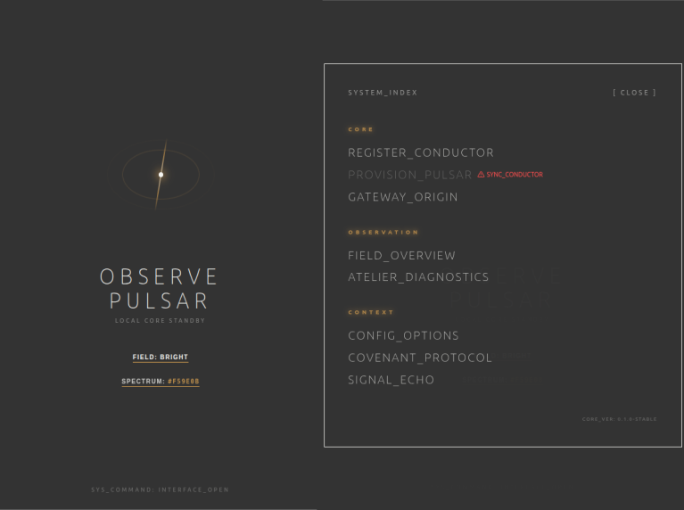

# Observe Pulsar — Sovereign IoT Ecosystem

**Observe Pulsar** is a vertically integrated IoT platform where every device communicates exclusively through encrypted WireGuard tunnels — no cloud brokers, no MQTT, no third-party accounts. Full Rust stack, from bare-metal firmware to mobile app.

---

## 00. Preface: The Sovereignty Doctrine

Observe Pulsar is not an IoT platform in the commercial sense. It is a sovereign networking stack — a complete, vertically-integrated system for creating private, encrypted, kernel-isolated peer-to-peer links between a mobile controller and ESP32 microcontrollers. 

There is no cloud intermediary, no subscription layer, no data extraction, and no external dependency on any corporation's uptime. This is not a platform that asks for your trust. It is a system that makes trust unnecessary — because the math is doing the work.

---

## 01. Technical Architecture

### The Architecture — Three Phases

1.  **Phase 1 — BLE Provisioning (Physical Contact).** Cryptographic identity is bestowed, not self-generated. The mobile "Conductor" app generates X25519 keypairs and transmits them via Bluetooth Low Energy directly to the hardware. Key generation happens on the trusted device — the phone — not the microcontroller.
2.  **Phase 2 — Boot Dispatch (Role Materialization).** On reboot, the firmware connects to WiFi and synchronizes time via SNTP. A role dispatcher reads the provisioning payload and materializes the device's specific logic (Observer, Actor, Flow, Kinetic, Vision, Link, Intent) based on a compiled role dispatcher.
3.  **Phase 3 — Runtime (The Live Tunnel).** The Conductor app and Firmware establish a direct WireGuard tunnel. The VPS relay is "dumb"—it only forwards encrypted packets and enforces kernel-level firewall isolation between tenants. The VPS never sees plaintext traffic.

### Bare-Metal WireGuard (Noise_IKpsk2)
The ecosystem implements the complete **Noise_IKpsk2** protocol from scratch in `no_std` Rust. This includes X25519 Diffie-Hellman, ChaCha20-Poly1305 AEAD, BLAKE2s hashing, and TAI64N timestamps for replay protection. This is not a library wrapper; it is a careful systems-level implementation running on an ESP32-C3 with no OS.

### Maturity by Domain
| Domain | Status |
|---|---|
| **Protocol Design** | Clean, no bloat, coherent end-to-end. |
| **Firmware** | Production-grade bare-metal WireGuard + Embassy async. |
| **Registry Server** | Functional registry with kernel-level `ipset` isolation. |
| **Conductor App** | Cross-platform (Tauri/Angular) with integrated BoringTun stack. |
| **System Integration** | Coherent 4-layer vertical stack. |

---

## 02. Philosophy

### The Covenant
The project is governed by a "Covenant"—a statement of design axioms that are architecturally enforced:
- **Zero-Extraction Rule**: The system is incapable of harvesting user data.
- **Non-Transactional Constraint**: The link is a tool for autonomy, not a service for consumption.
- **Tender Cut-off**: Architectural enforcement of privacy via mathematics rather than policy.

### Epistemic Honesty
The system acknowledges the "Principal Tension": the requirement for a VPS relay. While the relay is technically "dumb" and trust-minimized, it remains a central coordination point. This is an honest intermediate position on the path toward full decentralization.

---

## 03. Sociology

### Targeted Audience
Observe Pulsar is designed for technical practitioners—builders, engineers, and privacy-focused operators—who prioritize deep architectural control and digital sovereignty. The platform emphasizes understanding the underlying mechanics of the network over abstracting them away.

### Deployment Prerequisites
The setup process involves systems administration, firmware flashing, and cryptographic management. This approach ensures that operators maintain full visibility and agency over their infrastructure, upholding the security guarantees of the system.

---

## 04. Conclusion

**Observe Pulsar represents a unified approach to secure IoT: a system where technical rigor, architectural consistency, and user autonomy are inseparable.**

The implementation demonstrates the feasibility of high-security protocols on constrained hardware, leveraging a coherent data stack (Postcard) across embedded, server, and mobile environments. It serves as a benchmark for professional-grade systems where security is treated as a foundational requirement.

*Observe Pulsar provides the architectural foundation for secure, private networks, facilitating a shift toward more resilient and autonomous digital infrastructure.*

---

## 05. Request Access

The source code for the full ecosystem is currently hosted in a **Private Repository** to protect the architectural integrity during this phase of development.

If you have read this overview and wish to audit the source, contribute to the stack, or deploy a Pulsar network:

1.  Prepare your **Public SSH Key**.
2.  Contact the maintainer (Chris Karayannidis) with a brief description of your use case or reason for interest.
3.  Upon approval, you will be provided with a **Deploy Key** or repository access.

> [!NOTE]
> *Observe Pulsar is a specialized infrastructure project. Access is provided for those interested in auditing, contributing to, or deploying sovereign networking systems.*

---

Legal Notice & License

Copyright (c) 2026 Chris Karayannidis - Liturgy / Progressive Perceptions  
All Rights Reserved.

**PROPRIETARY AND CONFIDENTIAL.**

This software and its associated documentation are the sole property of Chris Karayannidis (Liturgy / Progressive Perceptions). Unauthorized copying, modification, distribution, or use of this software, via any medium, is strictly prohibited.

These materials are provided for demonstration and academic validation purposes only (e.g., CNAM VAPP/VAE). Any other use requires explicit written permission from the author.

**Project:** Observe Pulsar - Sovereign Infrastructure Stack  
**Reference:** OP-CORE-2026

